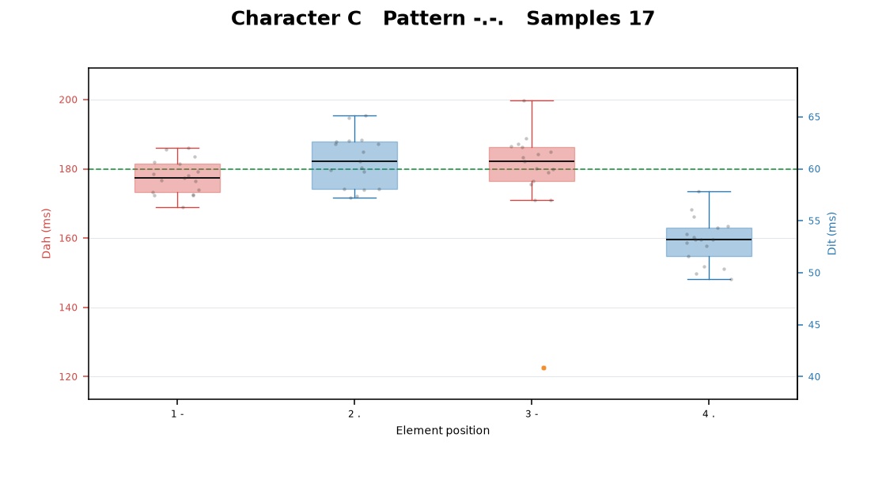
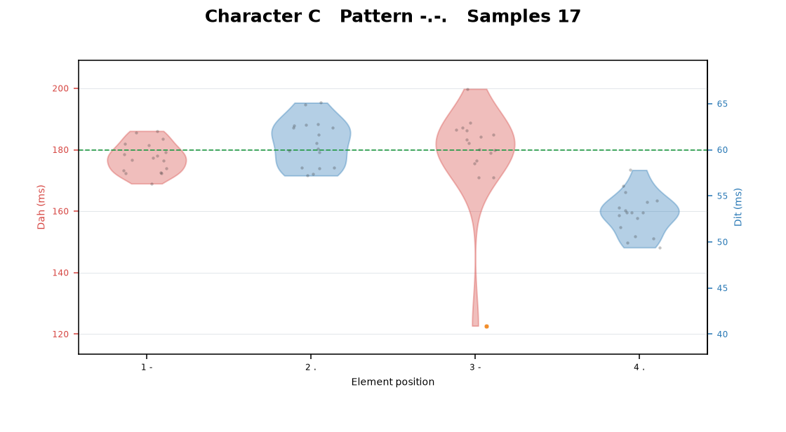
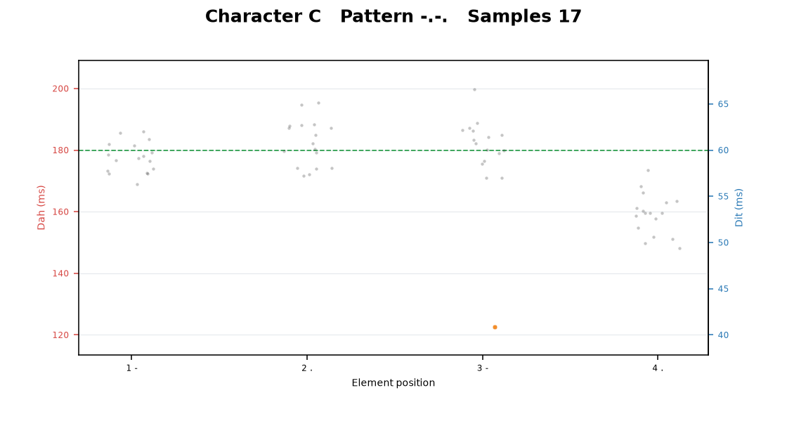
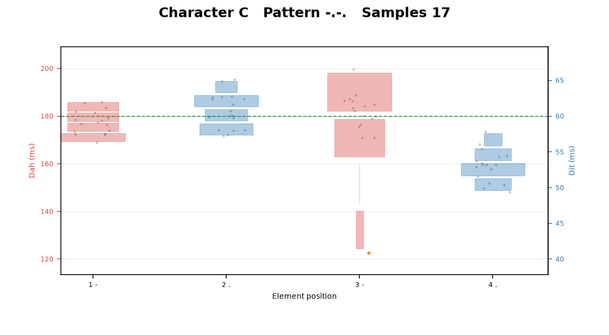

# CWAnalysis

Python 3 application that validates recorded CW timing CSV files, analyses every element position independently, and creates a printable PDF plus machine-readable statistics.

## Features

- Complete International Morse lookup for A-Z and 0-9.
- Streaming CSV ingestion: records are validated one at a time, so large inputs do not need a second in-memory copy.
- Per-character and per-position descriptive statistics, 95% confidence intervals, skewness, excess kurtosis, MAD, CV, and outlier counts.
- IQR or modified Z-score outlier detection.
- Linked dual-axis plots: dah timing uses the primary left axis and dit timing uses the secondary right axis, fixed at an exact 3:1 scale. Plots retain reproducible jitter, coloured element types, outliers, medians, and ideal timing references.
- First-page histograms for all dits, all dahs, the final dah in each letter, and the first dah of every adjacent dah pair.
- Separate visual summary pages for A-Z and 0-9. Letter panels reserve four element positions; number panels reserve five. Missing characters remain visible as labelled `No samples` panels. Detailed report pages contain six plots each.
- Character consistency, position-bias observations, estimated WPM for millisecond input, and a transparent heuristic fist-quality score.
- A4 or Letter PDF report, summary CSV, and rejected-row CSV.
- Box, violin, strip, and compact histogram/rug plot modes.

The quality and consistency scores are heuristic coaching indicators, not calibrated scientific or medical measures. A report generated without timestamps does not include trend analysis or session duration; the current CSV format has no time field.

## Plot examples

All plots analyse each element position separately. Dah timing uses the red left axis, dit timing uses the blue right axis, and the axes are linked at the ideal 3:1 ratio. The examples below show the same character C data in each available mode.

| Box (`--plot-type box`) | Violin (`--plot-type violin`) |
| --- | --- |
|  |  |
| **Strip (`--plot-type strip`)** | **Histogram (`--plot-type histogram`)** |
|  |  |

- **Box:** median, quartiles, 1.5-IQR whiskers, individual measurements, and orange outliers.
- **Violin:** a smoothed view of each position's distribution, with measurements and outliers overlaid.
- **Strip:** every measurement shown directly with stable horizontal jitter to reduce overlap.
- **Histogram:** compact mirrored frequency bars for each element position, with measurements and outliers overlaid.

Select a mode with either the executable or Python command:

```powershell
CWAnalysis.exe input.csv --plot-type violin
.venv\Scripts\cw-analyse input.csv --plot-type histogram
```

The documentation images can be regenerated with:

```powershell
.venv\Scripts\python tools\generate_readme_plots.py
```

## Full example report

View the complete report generated from the included 500-letter demonstration session:

- [CW Analysis full example PDF](docs/examples/CW_Analysis_Example.pdf)
- [500-letter source CSV](examples/sample_500_letters.csv)

The example includes the session overview, A-Z and 0-9 summary pages, detailed per-character plots, position-bias observations, and the explanatory notes appendix.

## Install

```powershell
py -m venv .venv
.venv\Scripts\python -m pip install -e ".[test]"
```

Python 3.10 or later is required.

## Standalone Windows executable

Windows users can run `CWAnalysis.exe` without installing Python. [Download the latest Windows executable](https://github.com/mad-bee/CWAnalysis/releases/latest/download/CWAnalysis.exe) and run:

```powershell
CWAnalysis.exe input.csv
```

The generated report and CSV files are written beneath `output` in the current directory. Windows may show a SmartScreen warning because community builds are not code-signed.

To build the executable from source:

```powershell
.\build_windows.ps1
```

The build script creates `dist\CWAnalysis.exe` using PyInstaller. A Windows build must be produced on Windows; executables for other operating systems must be built on those operating systems.

## Run

```powershell
.venv\Scripts\cw-analyse examples\sample.csv
```

A deterministic 500-letter example is also included:

```powershell
.venv\Scripts\cw-analyse examples\sample_500_letters.csv -o output\example_500
```

Outputs:

```text
output/
  CW_Errors.csv
  CW_Summary.csv
  pdf/CW_Analysis.pdf
```

The first row may be a `Character,...` header. Two layouts are accepted:

- compact rows containing one finite positive timing for each mark in the character's Morse pattern; and
- recorder exports headed `Character,mark1,space1,mark2,space2,...`. The analyser uses the mark columns and ignores space and unused trailing columns.

Invalid rows are skipped and included in `CW_Errors.csv`; up to 1,000 detailed error rows are retained while all rejection counts remain accurate.

Useful options:

```text
--units ms|ticks
--delimiter ";"
--plot-type box|violin|strip|histogram
--outlier-method iqr|modified-z
--page-size A4|LETTER
--dpi 72..600
--hide-points --hide-outliers --hide-reference-lines
--config config.json
```

See all options with `cw-analyse --help`. `config.example.json` contains the full colour scheme. Explicit command-line values take precedence over values read from the JSON configuration file.

## Tests

```powershell
.venv\Scripts\python -m pytest
```

## Notes on scale

The analyser retains accepted timing measurements because plots and exact quantiles require the observations. At 100,000 typical characters this remains comfortably below the 500 MB target. CSV parsing itself is streaming; malformed rows never terminate the run.

Fist score starts at 100 and applies penalties for aggregate CV, departure from a 3:1 median dash/dit ratio, and outlier frequency. Character consistency similarly combines average CV and outlier rate. Fixed formulas make repeated runs reproducible, and plot jitter uses a fixed random seed.
